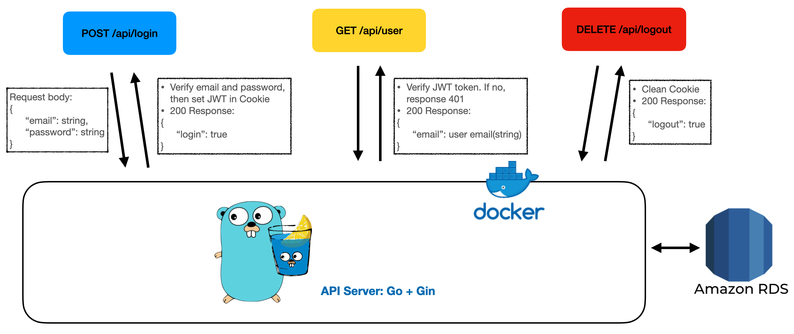
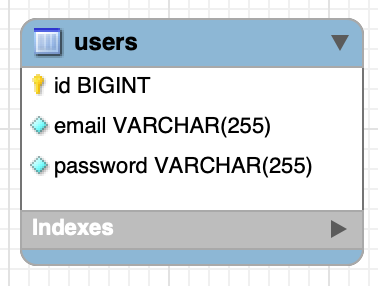

## How to use?

1. Pull the image from docker hub

```
docker pull a05031113/challenge
```

2. Run with port 3000

```
docker run -p 3000:3000 a05031113/challenge

```

## APIs

- POST /api/register

```
Request body = {
    "email": "example@example.com"
    "password": "example123"
}

Responses:
    200: {
        "register": true
    }
    400: Fail with wrong format or account already exist or missing data
    500: Internal Error
```

- POST /api/login

```
Request body = {
    "email": "example@example.com"
    "password": "example123"
}

Responses:
    200: {
        "Login": true
    }
    400: email or password is incorrect
    500: Internal Error
```

- DELETE /api/logout

```
Request body = None

Responses:
    200: {
        "Logout": true
    }
```

- GET /api/user

```
Request body = None

Responses:
    200: {
        "email": "example@example.com"
    }
    401: Unauthorized
```

## Architecture



### Backend Language and Framework

- Golang
- Gin-Gonic

### Database

- AWS RDS (MySQL)  
  

## Thinking

I need to create three APIs about member system so I need to create a user first. The first API I wrote is "POST /api/register" to create first user and bcrypt the password.  
Second, I need to authorize the user is login or not so I also need to choice the way to check. I use JWT to authorize since it is stateless and light weight and put JWT in HTTP-only Cookies to prevent XSS attack. After email and password verified with "POST /api/login", server will set JWT in Cookies.  
Third, if user login already, user can get information by "GET /api/user". The only information is email, so user will get user's email. If not login or incorrect JWT, server will response 401 Unauthorize.
Finally, if user logout with "DELETE /api/logout", server will remove JWT's Cookies.
