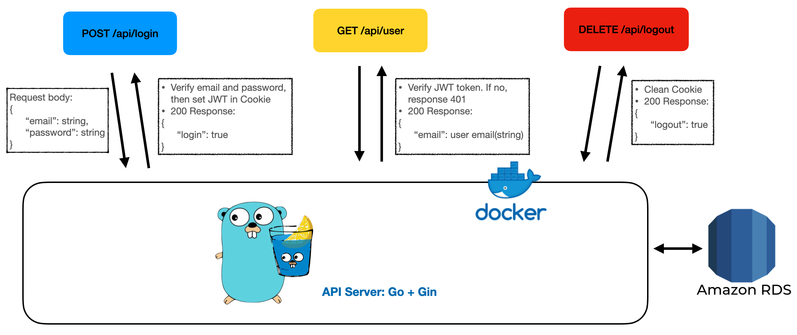
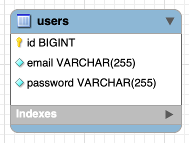

# Q1. Design an API service to handle user authentication

## How to use?

1. Pull the image from docker hub

```
docker pull a05031113/challenge
```

2. Run with port 3000

```
docker run -p 3000:3000 a05031113/challenge
```

## APIs

- POST /api/login

```js
Request body = {
    "email": "example@example.com"
    "password": "example123"
}

Responses:
    200: {
        "Login": true
    }
    400: email or password is incorrect
    500: Internal Error
```

- DELETE /api/logout

```js
Request body = None

Responses:
    200: {
        "Logout": true
    }
```

- GET /api/user

```js
Request body = None

Responses:
    200: {
        "email": "example@example.com"
    }
    401: Unauthorized
```

## Architecture



### Backend Language and Framework

- Golang
- Gin-Gonic

### Database

- AWS RDS (MySQL)  
  

## Thinking

I need to create three APIs about member system so I need to create a user first. The first API I wrote is "POST /api/register" to create first user and bcrypt the password.  
Second, I need to authorize the user is login or not so I also need to choice the way to check. I use JWT to authorize since it is stateless and light weight and put JWT in HTTP-only Cookies to prevent XSS attack. After email and password verified with "POST /api/login", server will set JWT in Cookies.  
Third, if user login already, user can get information by "GET /api/user". The only information is email, so user will get user's email. If not login or incorrect JWT, server will response 401 Unauthorize.  
Finally, if user logout with "DELETE /api/logout", server will remove JWT's Cookies.

# Q2. SQL syntax

```sql
SELECT category, COUNT(DISTINCT menus.id) FROM muscle_menus
INNER JOIN muscles ON muscle_id = muscles.id
INNER JOIN menus ON menu_id = menus.id
WHERE muscles.name = "muscle1" or muscles.name = "muscle2"
GROUP BY category;
```

## Result

| category | COUNT(DISTINCT menus.id) |
| :------: | :----------------------: |
| training |            3             |
| balance  |            1             |
| stretch  |            1             |

## Thinking

I fix the problem with DISTINCT, which will count each unique value of category once.

# Q3. Investigate how to implement Upload file though API

There are two ways to uploading file such as photo or video to storage like AWS S3. First way is upload to server first and server will upload to storage. Second way is upload from client to storage directly.  
Pros of first way is backend will get the file so it can make sure what the file is. However, cons is obvious too. Due files won't be storage in backend server, it not only slow down the process also spend to much server resource.  
Another way is upload directly from client. Pros of this way is apparent. It does not need two upload process so it is much faster than first way. Nonetheless, setting upload API at client is unsafe, which means everyone who see it can upload everything on it and server does not know. The way to fix it is using presigned url. When client want to upload file, he/she will get the upload url which is generated by server through GET API. The url is temporary which means even other get the url, it will be expire soon. As a result, no matter who wants to upload file server will know it.

# Q4. Investigate how to implement realtime Chat feature though API

To accomplish realtime Chat feature, WebSocket is a good option to do it. Same with HTTP, WebSocket is a protocol also based on TCP, which make sure that data will not get lose. Different with HTTP which is stateless, WebSocket is stateful. Client will send a HTTP request to upgrade connection to WebSocket. The process of upgrade call handshake. After handshake, server does not need to check connection every time so the message can transmit in realtime.


# Q5. Investigate how to implement APIs for mobile app? Will it different as web app?

Same with web app, mobile also need a server and get data by APIs. APIs can be implement by RESTful API. Mobile app can use method same with web app such as GET, POST, PUT, PATCH, DELETE to get, update or delete data. However, the most difference between web app and mobile app is mobile app does not have Cookies. As a result, mobile usually use OAuth to do authentication.

# Q6: How do you design a background process run once per hour?

To run a background process once a hour, there is a way call CRON. In golang, there is a package, gocron, can do this. Here is an example from the package's GitHub:

```go
package main

import (
	"fmt"
	"time"

	"github.com/go-co-op/gocron"
)

func task() {
	fmt.Println("Print this once a hour")
}

func main() {
	s := gocron.NewScheduler(time.UTC)
	s.Every("1h").Do(task)
	s.StartBlocking()
}
```

For this code, string, "Print this once a hour", will be printed every hour and run in background.
